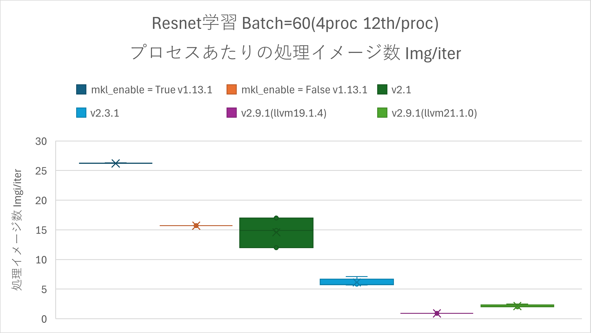
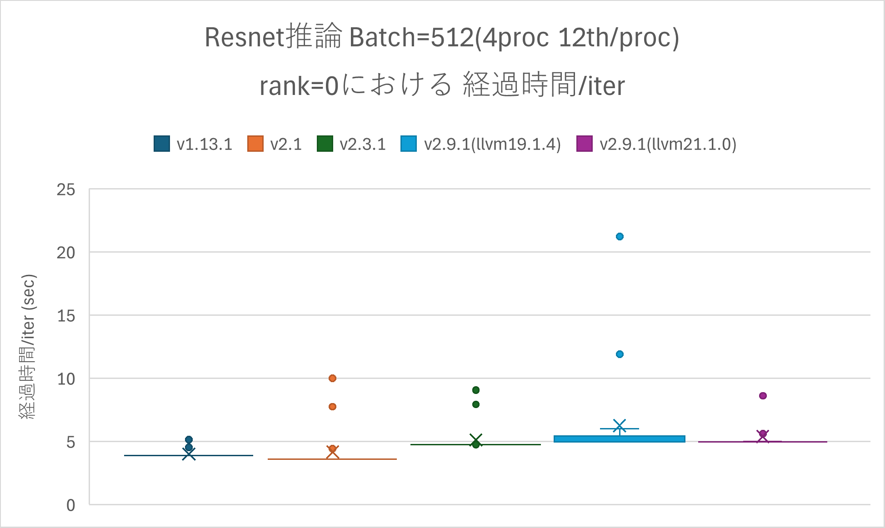

# マルチプロセスの性能比較<a href="#id1" class="headerlink" title="Link to this heading">¶</a>

マルチプロセスでResnetを実行したときの学習と推論の性能を比較する。学習については、
使用したPythonスクリプトの出力がプロセスあたりの処理速度(Img/sec)となっているため、その値を用いる。
また、性能評価対象として、プログラムの中でイタレーションを5回実行し、1イタレーションに要する処理速度を採用した。値が大きいほど高性能である。
推論については、シングルプロセスでの実行の場合と同様にプログラムの中でイタレーションを20回実行し、1イタレーションに要する平均の経過時間を採用する。その際、複数rankからそれぞれの経過時間が出力される。そのうちのrank=0から出力を用いるものとする。値が小さいほど高性能である。

<figure class="align-default">

</figure>

<figure class="align-default">

</figure>

上記の比較から、v2.9.1における学習の性能はv2.3.1に比べ極めて悪い結果となっている。特にv2.9.1(llvm
19.1.4)ではv2.3.1にくらべ1/6程度の性能となっている。同じコンパイラを使ってこのような差異が生じることから、v2.9.1のソース中に何等かの原因があると推測される。v2.9.1(llvm
21.1.0)については、v2.3.1にくらべ1/3程度の性能劣化がある。v2.9.1(llvm
19.1.4)ほど極端でないもののこれも相当程度劣化している。推論においては、v2.9.1(llvm
19.1.4)はv2.3.1に比べ、1.1倍程度性能が悪い結果となっている。 v2.9.1(llvm
21.1.0)はv2.3.1と同程度の性能となっている。
なお、マルチプロセス学習においてはマルチプロセス実行のためにhorovodを利用している。horovodは最近数年間バージョンアップが無く、最近のPyTorchを考慮していない。これが性能低下の原因になった可能性がある。
