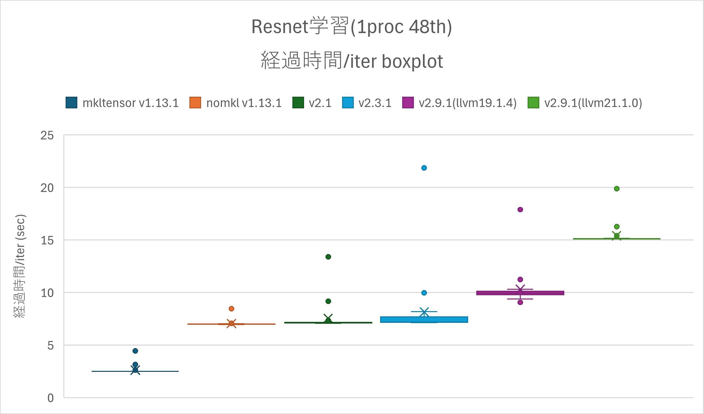
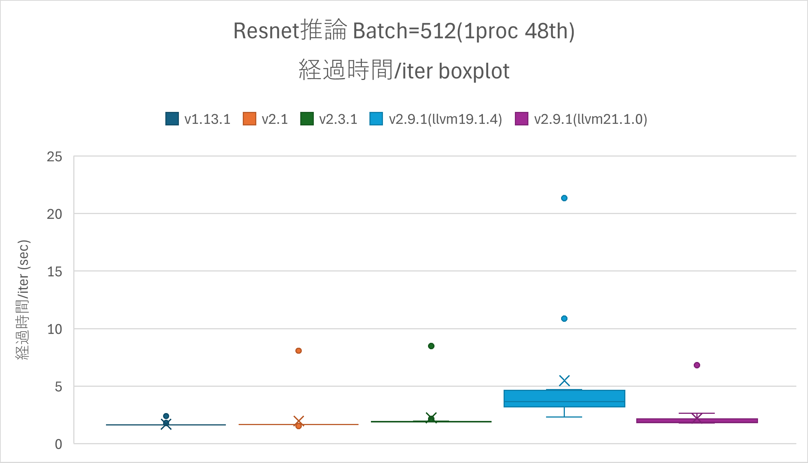
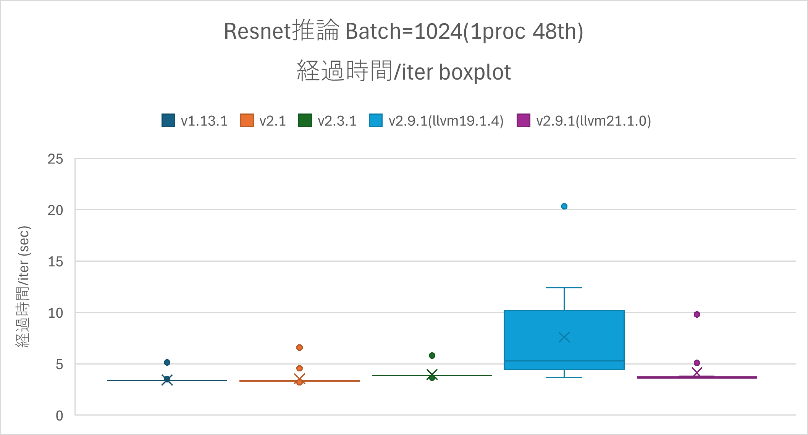

# シングルプロセスの性能比較<a href="#id1" class="headerlink" title="Link to this heading">¶</a>

シングルプロセスでResnetを実行したときの学習と推論の性能を比較する。性能評価対象として、プログラムの中でイタレーションを20回実行し、1イタレーションに要する経過時間を採用する。値が小さいほど高性能である。

<figure class="align-default">

</figure>

<figure class="align-default">

</figure>

<figure class="align-default">

</figure>

v2.9.1(llvm
19.1.4)における学習の性能は同じくOneDNNを用いないv2.3.1に比べ数割程度経過時間が長い結果となっている。v2.9.1(llvm
21.1.0)では、さらに性能が悪くv2.3.1に比べ2倍程度経過時間が長い。推論については、v2.9.1(llvm
19.1.4)では、イタレーション間の時間ばらつきが大きい。同じコンパイラを使っているv2.3.1ではこのようなばらつきが見られないことから、v2.9.1のソース中に何等かの原因があると推測される。
v2.9.1(llvm 21.1.0)については、v2.3と同程度の性能となっている。
